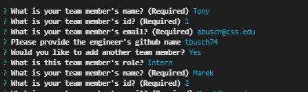

# Team-Profile-Generator

  

  ## Description

  This repository is for the 8th weekly challenge for the University of Minnesota coding boot camp submitted by Tony Busch. This project takes command-line inputs about employees in a company and generates an HTML page showing all of the employees and their roles.

  ## Table of Contents
  
  * [Installation](#installation)
  * [Usage](#usage)
  * [License](#license)
  * [Questions](#questions)
  
  ## Installation

  To install this project, clone the repository and install the required dependencies.
  
  ## Usage

  Once set up, the command line interface will guide you through the required prompts as shown below. 
  
  

  Once all prompts are answered a page will be generated in the "dist" folder of the project directory.
  
  ## License

  This project is governed by the terms stated in the MIT License. A copy of the license can be found at https://choosealicense.com/licenses/mit/
  
  ## Questions

  Visit https://watch.screencastify.com/v/XzrGNf3tBt0ErKHSgcrS to see a video of the app in action!

  See the testing of this application here:https://watch.screencastify.com/v/4Ajjd7B7orMqtZZuLobr

  View this project and my other projects at <https://github.com/tbusch74>

  Please reach out to <abusch@css.edu> with any other questions.

